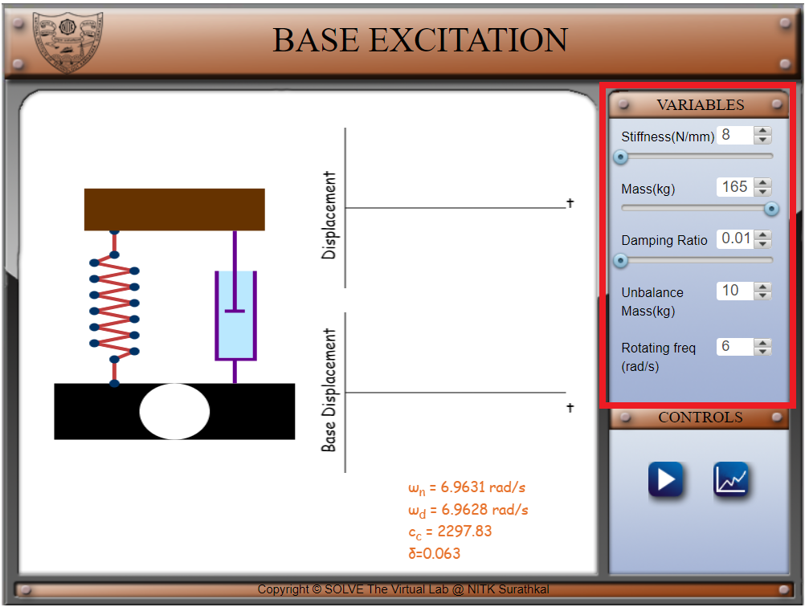
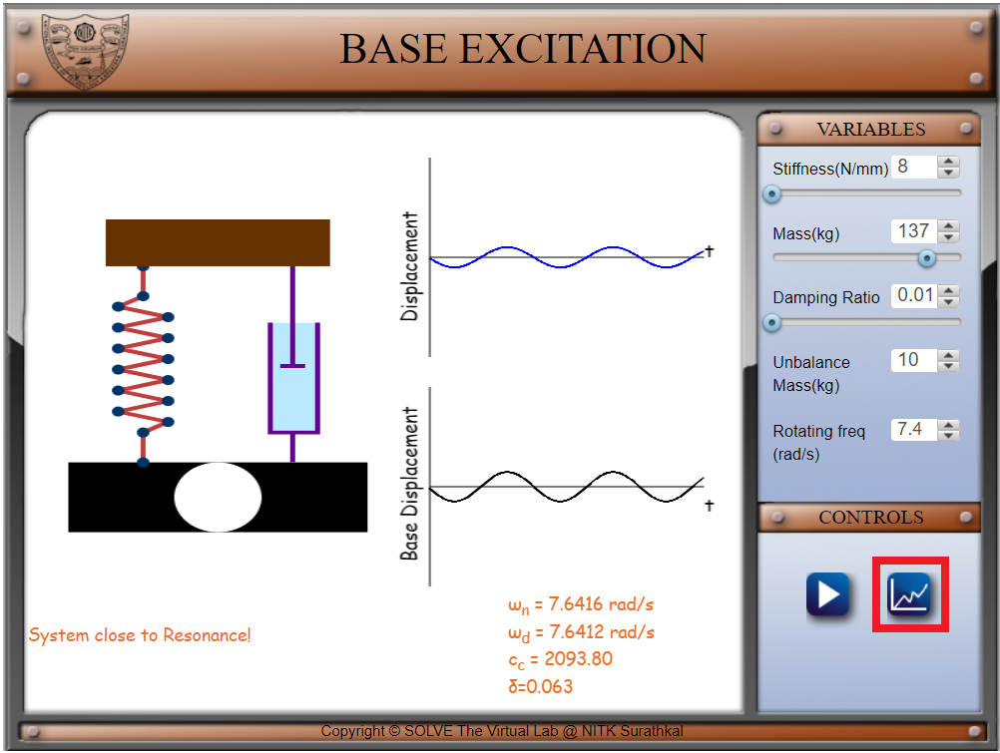
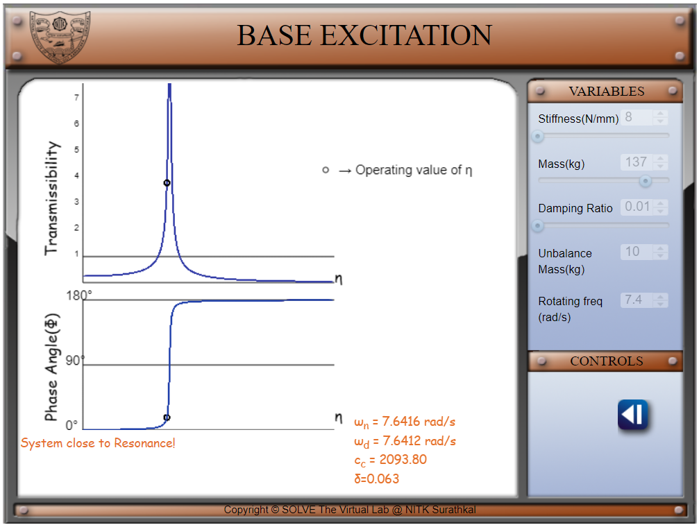
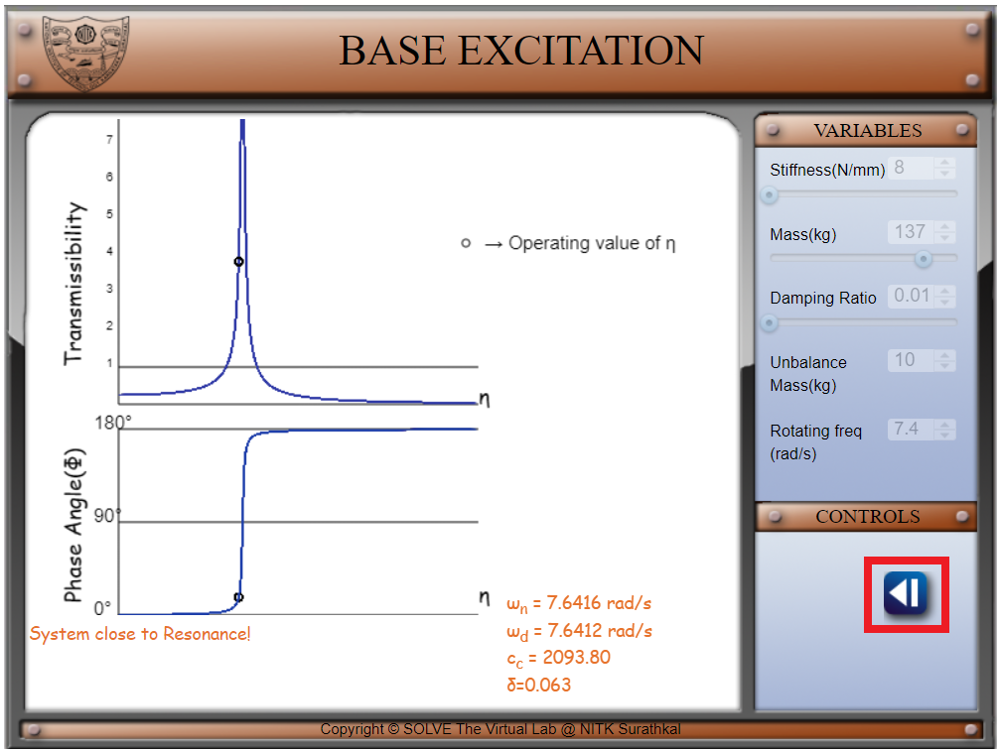
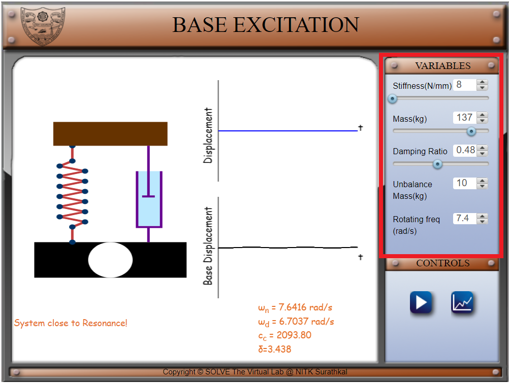

##### These procedure steps will be followed on the simulator 

1.Set a value of Stiffness and Mass for the system. Set a small value of damping ratio (less than half of 0.707). Notice the natural frequency of the system shown below the graphs. You can change the value of unbalance mass and rotating frequency as well. 
  
2.Click on the graph icon to load the graph of transmissibility and phase angle versus frequency ratio. 
  
  
3.Click on the left arrow to come back to the system display screen. Edit the damping ratio. Set to a value between 0.35 and 0.707. 
  
  
4.Click on the graph icon to load the graph of transmissibility and phase angle versus frequency ratio. Observe the change in transmissibility and phase angle curve. 