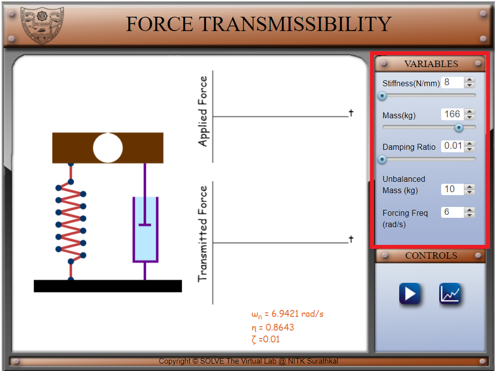
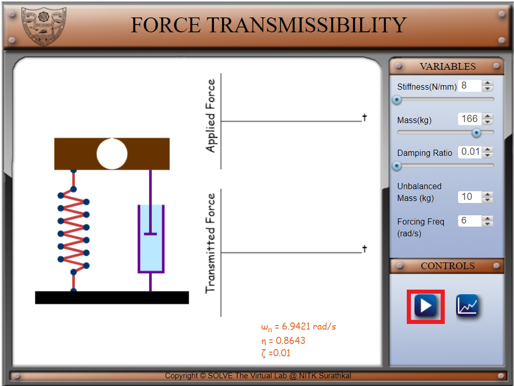
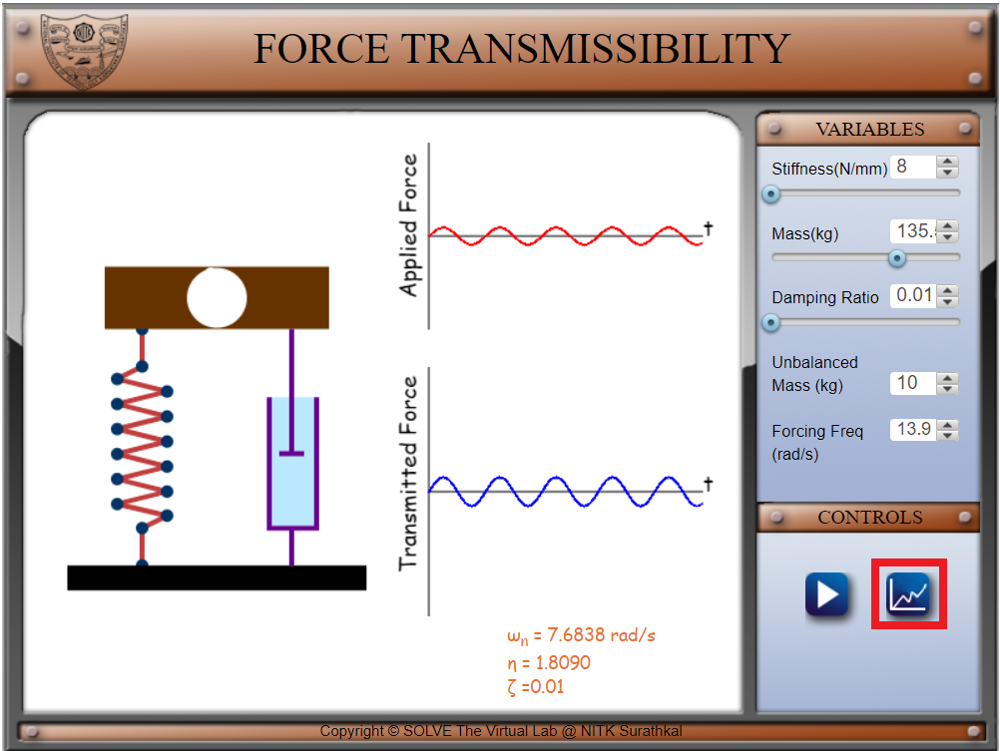
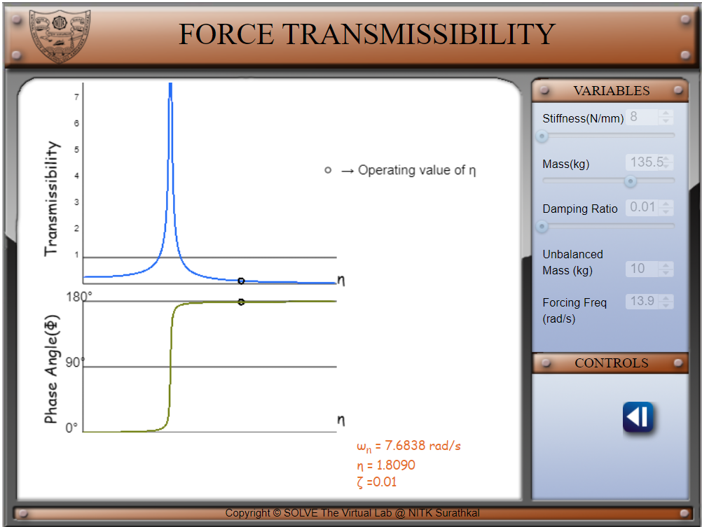

##### These procedure steps will be followed on the simulator 

1.Set a value of Stiffness and Mass for the system. Set a small value of damping ratio (less than half of 0.707). Notice the natural frequency of the system shown below. Set a value of rotating speed in rpm which is not very close to natural frequency. You can also set a value for unbalance which is unbalanced mass times eccentricity. 
 
2.Click on the play icon to start the simulation.You can notice the applied force vs time and transmitted force vs time graphs 
 
3.Click on the graph icon to load the graph of transmissibility and phase angle versus frequency ratio. 
  
  
4.Click on the left arrow to come back to the system display screen. Increase the value of damping and observe the change in transmissibility. 