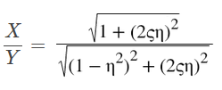

## Introduction 
Any vibrating body will transmit a certain amount of its energy to the base on which it is mounted.This causes the base also to vibrate with a certain frequency. We consider a rotating imbalance which causes a body to vibrate with a certain frequency. 
#### Rotating imbalance 
Rotating Unbalance is the uneven distribution of mass around an axis of rotation. Unbalance is caused when the center of mass (inertia axis) is out of alignment with the center of rotation (geometric axis). When an object is forced to spin about a fixed axis, if the mass is not evenly distributed about that fixed axis then a centrifugal force resulting from this unbalance induces an exciting force due to which the structure vibrates.Unbalance in rotating machines is a common source of vibration excitation that one sees in everyday life such as vibration of automobile engines or the washing machine. One might have experienced the effect of vibration due to rotating unbalance while driven a car where the wheels are not balanced. At some particular speed the car will shake, sometimes quite violently. At this speed, the rotational speed of the wheels is such as to be close to the natural frequency of the car on its suspension, so that the amplitude becomes a maximum. This phenomena is really important because if not dealt with promptly one could have catastrophic failures due to the fatigue caused by the vibration.To study the effect of vibration due to rotating unbalance, an unbalanced rotating machine modelled as a single degree spring mass damper shown in figure having an equivalent unbalance mass m rotating at frequency ω with its centre of gravity at a distance e from the axis of rotation. This results in a centrifugal force proportional to the square of frequency of rotation. The centrifugal force is the maximum value of sinusoidal excitation in any direction.. 
 
The equation of motion in the vertical direction can be written as, 
 
Where M is the mass of the structure, c is the damping present in the system and k is the stiffness of the system.
Steady state amplitude X and phase angle due to vibration caused by rotating unbalance is given by, 
 
#### Force Transmissibility 
The equation for force transmissibility is given as 
F1/F=√(1+(2πζ)2)/√((1-r2)+(2ζr)2) 
where F1 is the forcing amplitude of the vibrating body and F is the force transmitted to the base.

Transmissibility vs frequency ratio r(operating frequency(w)/natural frequency(wn)) for different values of damping ratio is given below: 
 
When a single-degree-of-freedom (sdof) system is excited by a continuous motion of the foundation, the force transmissibility, relating the force transmitted to the foundation to the applied force, equals the displacement transmissibility,ie,both force transmissibility(F1/F2) and displacement transmissibility(X/Y) equals 
 