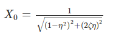

## Post test
 
Q1.What is the phase difference between input and response for a system with 10kg mass 10N/m stiffness and 15Ns/m damping being operated at 0.5 rad/s? 
a.90° 
b.30° 
c.60° 
<b>d.45°</b>  

Q2.Amplification factor of a system was found to be 4 at resonance. What would be its damping ratio? 
 a.0.5 
 b.0.25 
 <b>c.0.125</b> 
 d.1  

Q 3.
The above equation gives the steady state amplitude for a system excited by an external harmonic force. 
 a.true 
 <b>b.false</b>  

Q4.If the damping ratio of the system is 0.25, find its logarithmic decrement 
<b>a.1.62</b> 
b.2.44 
c.3.62 
d.4  

Q 5.If the damping ratio of a system is 0.5 and its frequency ratio is 0.8 then its magnification factor will be 
a.1.56 
b.0.88 
c.2.33 
<b>d.1.14</b>  