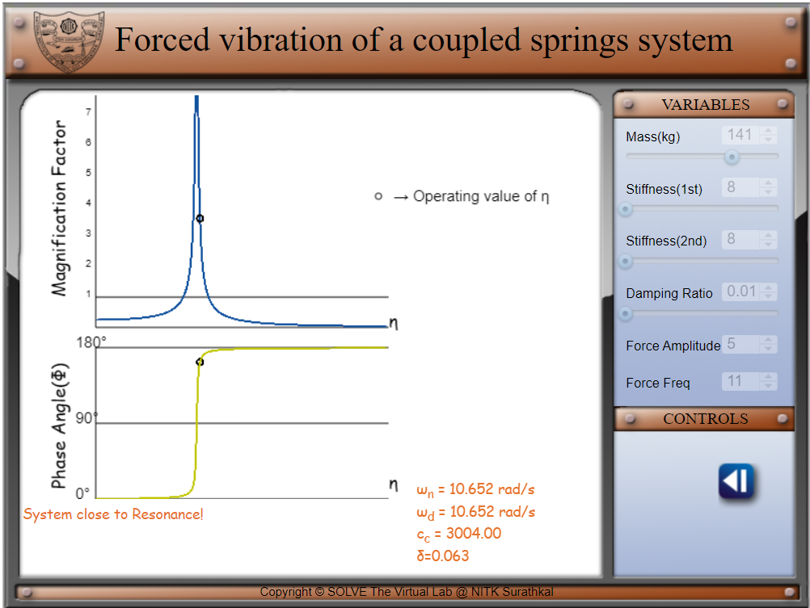

##### These procedure steps will be followed on the simulator 
1. Set a value for mass, stiffness-1, stiffness-2 and damping ratio before you begin the experiment. Click on the play button to start the simulation. Observe the displacement vs time graph. 
 
2.Click on the graph icon to view the magnification factor and phase angle vs frequency graphs. 
 
 
3.Click on the back button to return to the simulation page. 
 
4.Change the values of stiffness, damping ratio and mass and observe the change in displacement time graph.
