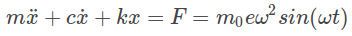
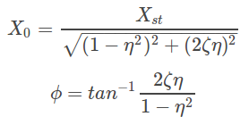

## Introduction  
When an applied force causes the system to vibrate it is considered as a case of forced vibration. The external force applied on the system can be of one of the following types. 
#### External Harmonic Force 
 
#### Base Excitation 
 
 where is the motion of the base 
#### Rotating Imbalance 
   where m0 is the imbalance mass ,e is the eccentricity of imbalance mass and ω is the angular velocity(rad/s) of rotation 

Here the system consists of a mass attached between two springs which we assume for simplicity. Note that if we had placed both springs on the same side of the mass, then the physics would not be different from what we have here – instead of two forces in the same direction because one spring is compressed and the other expanded, the two forces would be in the same direction because both are stretched or expanded, and the magnitudes of the Hooke's law forces are the same in both directions.This system behaves exactly like a single-spring harmonic oscillator, but with what frequency? To answer this, we basically need to find the single spring constant that is equivalent to these two springs. We can do this by displacing the mass a distance  Δx  and seeing what restoring force is the result for each case. As stated above, the forces by both springs are in the same direction, so: 

 

In order to be equivalent, these restoring forces must be equal, so we get a way of writing these two springs as a single equivalent spring: 
 
Now the system can be modeled to be the free vibration of a simple spring mass system vibrating in its natural frequency with k=keq
Natural frequency of the system : 
			 ωn=√keq/m
In this experiment, a harmonic external force is applied to the system and its governing differential equation is as follows 
     

##### Solution of the System 
 
The solution of the forced vibration system consists of a steady state part and a transient part. The steady state response is independent of the initial conditions. The transient part comes to zero with time and is usually neglected. The steady state response is of the form  
where X0 is the amplitude and φ is the phase of steady state vibration. For  external harmonic excitation the steady state parameters are given by 
     

where  is the deflection due to static force F0 and η = ω/ωn is the ratio of operating frequency to the natural frequency of the system. Here  k=keq where keq is the equivalent stiffness of the system.