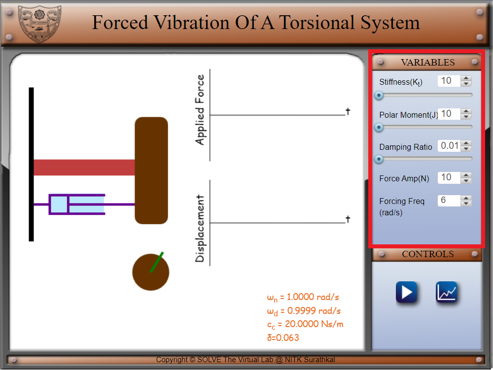
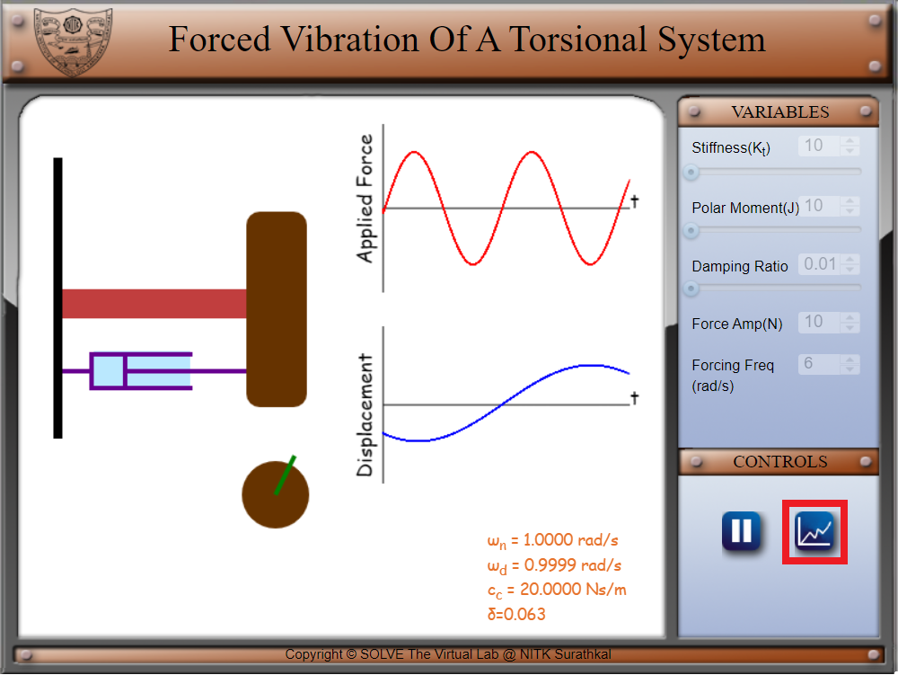
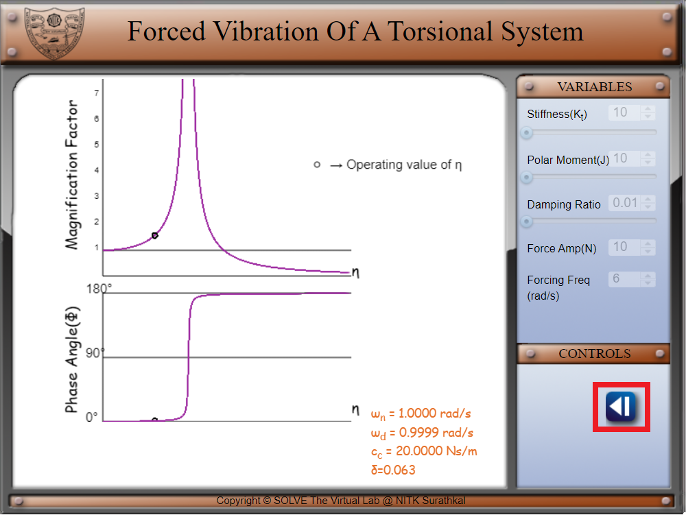
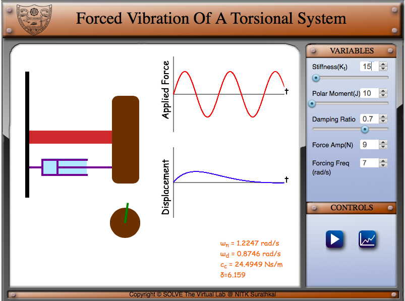

##### These procedure steps will be followed on the simulator 
1.Set a value of stiffness(Kt), Polar Moment(J)  and damping ratio before you begin the experiment. Also select an appropriate value for external force(both amplitude and frequency). Click on the play button to start the experiment.Observe the value of natural frequency given below. 
 
2.The front view of the torsional system is shown where the green marker shows the angular displacement of the body. 
3.Click on the graph icon to view the magnification factor and phase angle vs frequency ratio graphs. The operating frequency is marked in the graph. 
 
 
4.Click on the back button to return to the simulation page. Change the value of damping ratio(set it to 0.707).Also change the values of forcing amplitude and frequency. 
 
5.Go back to the graph screen and observe the change in magnification factor and phase angle graphs 