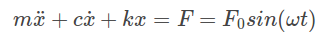
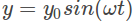
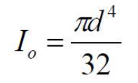
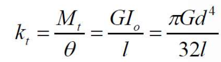

## Introduction 
When an applied force causes the system to vibrate it is considered as a case of forced vibration. The external force applied on the system can be of one of the following types. 
#### External Harmonic Force 
 
#### Base Excitation 
 where  is the motion of the base 
#### Rotating Imbalance 
where m0 is the imbalance mass, e is the eccentricity of imbalance mass and ω is the angular velocity(rad/s) of rotation

#### Torsional Systems 
Torsional vibration is the oscillatory twisting of the shafts in a rotor assembly that is superimposed to the running speed. The frequency can be externally forced or can be an eigenvalue (natural frequency of the torsional system). Resonance will occur if a forcing frequency coincides with a natural frequency. 

For a torsional system undergoing vibrations the governing differential equation is- 
Jθ’’+cθ’+kθ= Fosin(wt) 
where Fosin(wt) is the external excitation.
 
The resistance of a cylindrical object to torsional deformation when torque is applied in a plane parallel to the cross-section area or perpendicular to the object's central axis is referred to as the polar moment of inertia. It is given by 
 
The relation between polar moment of inertia, rigidity modulus, torque is 
 
where Mt is the torque applied on the system.