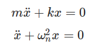
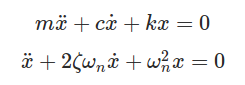

## Introduction 
We will assume for simplicity that the mass is attached between the two springs when both are at equilibrium. This is not a necessary assumption, because if they are not at equilibrium, a new equilibrium point (where both springs are slightly stretched or slightly compressed) exists, not changing any of the analysis. Note that if we had placed both springs on the same side of the mass, then the physics would not be different from what we have here – instead of two forces in the same direction because one spring is compressed and the other expanded, the two forces would be in the same direction because both are stretched or expanded, and the magnitudes of the Hooke's law forces are the same in both directions. 

This system behaves exactly like a single-spring harmonic oscillator, but with what frequency? To answer this, we basically need to find the single spring constant that is equivalent to these two springs. We can do this by displacing the mass a distance  Δx  and seeing what restoring force is the result for each case. As stated above, the forces by both springs are in the same direction, so: 
 
In order to be equivalent, these restoring forces must be equal, so we get a way of writing these two springs as a single equivalent spring: 
 
Now the system can be modeled to be the free vibration of a simple spring mass system vibrating in its natural frequency with k=keq 
Natural frequency of the system : 
ωn=√keq/m 
The governing equation for such a  system under free vibration without damping is as below: 
 
But in real systems some amount of damping will be present. The governing equation for a coupled spring system under free vibration with damping is as below: 
 
c is the damping present in the system and ζ is the damping factor of the system which is nothing but ratio of damping c and critical damping cc. Critical damping can be seen as the damping just sufficient to avoid oscillations. At critical condition ζ=1. For real systems the value of ζ is less than 1. For systems where ζ < 1 the differential equation solution is a pair of complex conjugates. The displacement solution is given by 
 
where x0 and v0 are initial displacement and velocity and ωd is the damped natural frequency of the system. The damped natural frequency is calculated as below: 
 
#### Logarithmic decrement 
The logarithmic decrement represents the rate at which the amplitude of a free-damped vibration decreases. It is defined as the natural logarithm of the ratio of any two successive amplitudes. It is given by the expression  
δ=2πζ/√1-ζ2 
Where ζ is the damping ratio