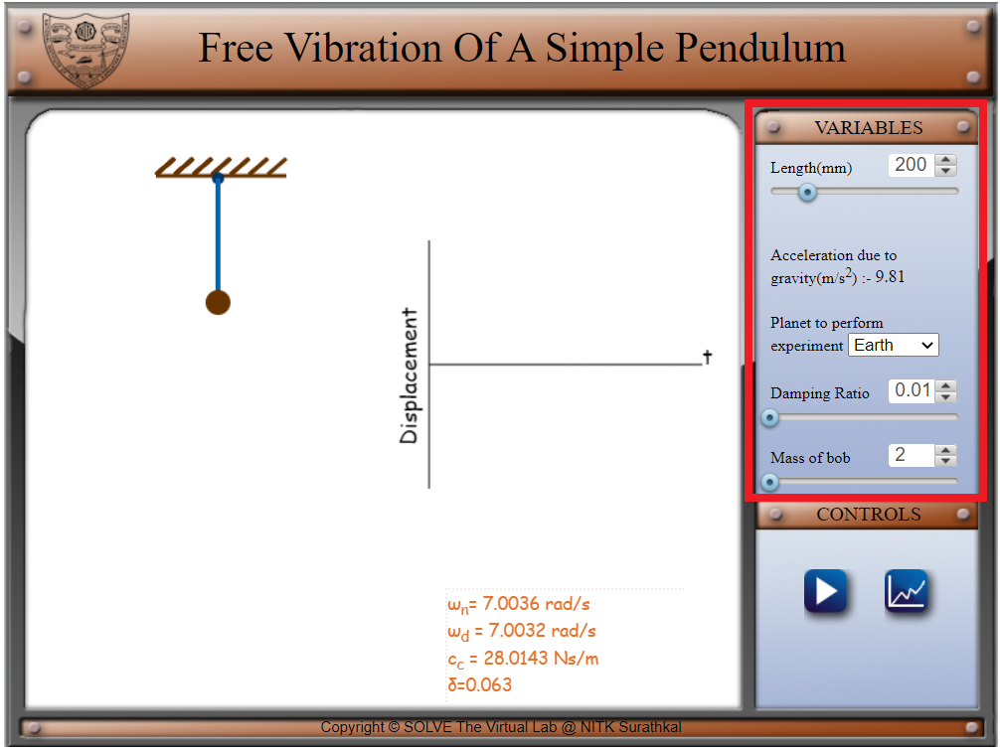
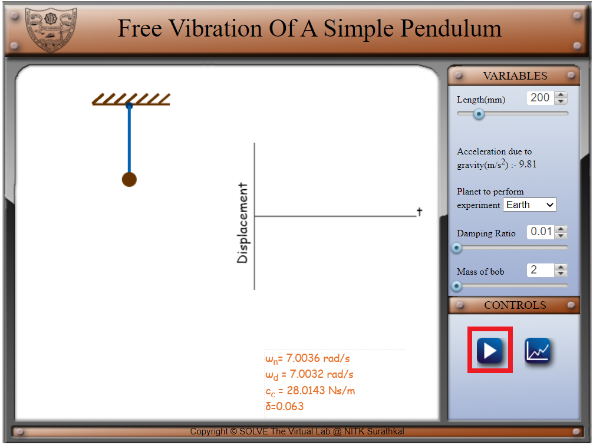
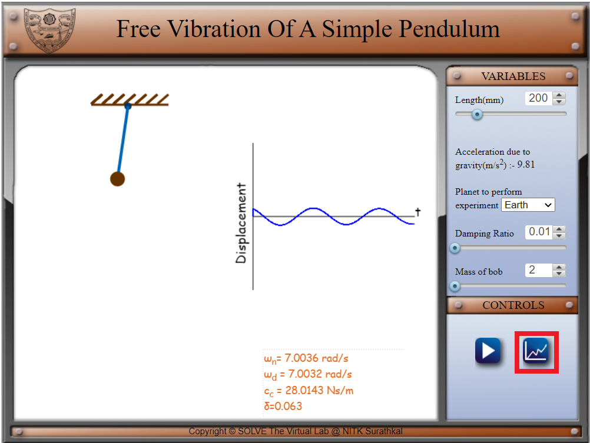
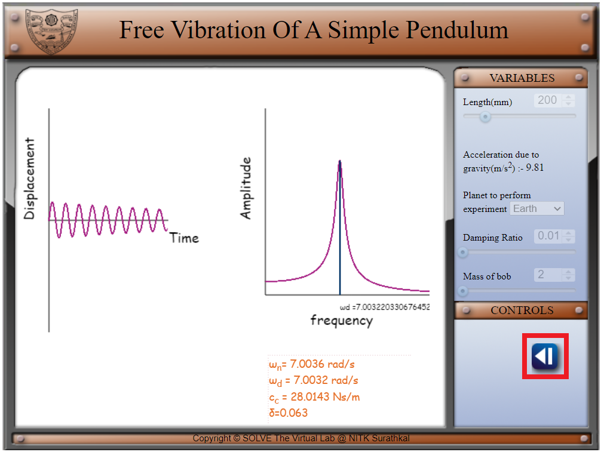
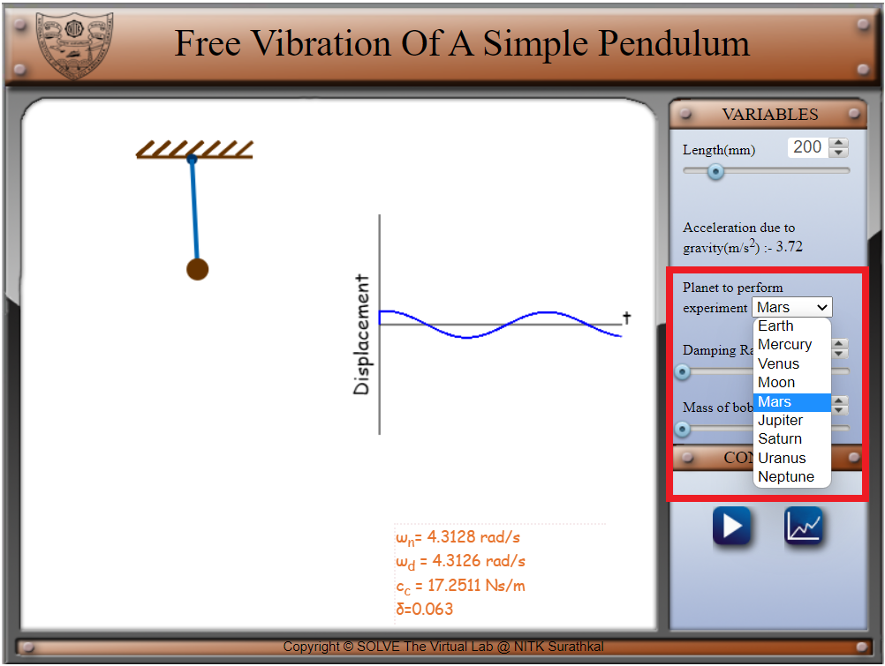

##### These procedure steps will be followed on the simulator 
1.Set a value of length and damping ratio before you begin the experiment. Click on the play button to start the simulation. Observe the displacement vs time graph as well as the natural frequency of the system given below. 
 
 
2.Click on the graph icon to view the displacement vs time graph and the amplitude vs frequency graph. The damping frequency can be observed at the peak of the amplitude vs frequency graph. 
 
 
3.Click on the back button to return to the simulation page. Change the values of damping frequency and change the environment setup from earth to mars 
 
4.Observe the change in natural frequency and displacement time graph. 