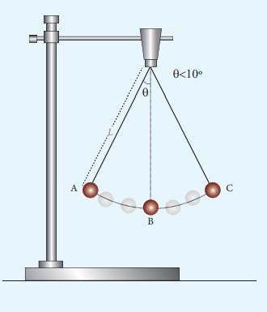

## Introduction 
An ideal simple pendulum consists of a heavy point mass (called bob) tied to one end of a perfectly inextensible, flexible and weightless string. In practice, we make it by tying a metallic spherical bob to a fine cotton stitching thread. 
 

#### Length of a Simple Pendulum : 
The distance between the point of suspension of the pendulum and its Center of Gravity (C.G.), which is the C.G. of the bob, is called the length of the simple pendulum. It is represented using the alphabet ( l ). 
#### Time Period of a Simple Pendulum : 
Time period is the time taken by the bob of the simple pendulum to make one complete oscillation. It is represented by the letter T.The time period of a simple pendulum depends on the length of the pendulum (l) and the acceleration due to gravity (g), which is expressed by the relation, 
                            
                            T=2π√l/g

The pendulum when it is given a small displacement from its mean position, it oscillates freely in its natural frequency. Here we make an assumption that the pendulum only makes small oscillations in order to approximate the motion of the pendulum as simple harmonic motion. 

Natural frequency of the pendulum : 
		
wn=√g/l 

The governing equation for such a  system under free vibration without damping is as below: 
		
ẍ+wn2x=0 
But in real systems some amount of damping will be present. The governing equation for a simple pendulum under free vibration with damping is as below: 

ẍ+2ζwnẋ+wn2x=0

c is the damping present in the system and ζ is the damping factor of the system which is nothing but ratio of damping c and critical damping cc. Critical damping can be seen as the damping just sufficient to avoid oscillations. At critical condition ζ=1. For real systems the value of ζ is less than 1. For systems where ζ < 1 the differential equation solution is a pair of complex conjugates. The displacement solution is given by 

 

where x0 and v0 are initial displacement and velocity and ωd is the damped natural frequency of the system. The damped natural frequency is calculated as below: 
 

#### Logarithmic decrement 
The logarithmic decrement represents the rate at which the amplitude of a free-damped vibration decreases. It is defined as the natural logarithm of the ratio of any two successive amplitudes. It is given by the expression  
δ=2πζ/√1-ζ2 
Where ζ is the damping ratio
