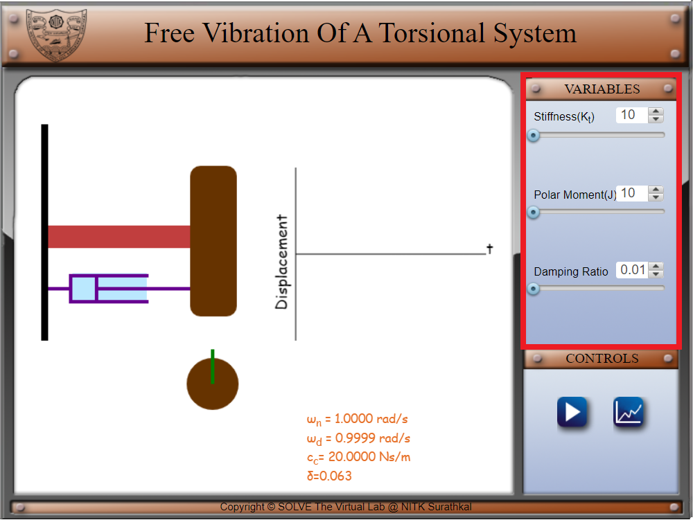
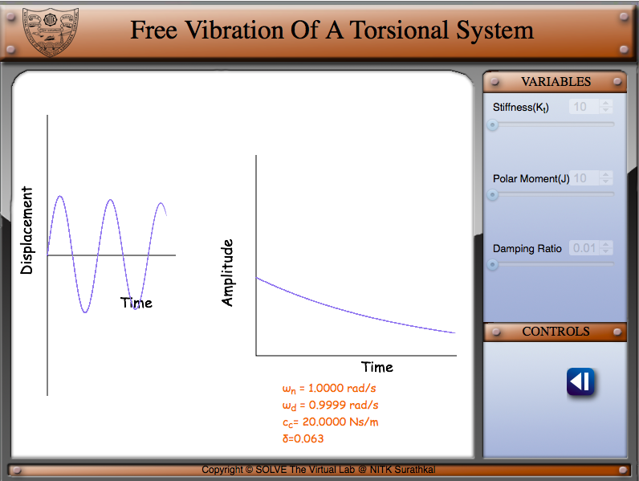
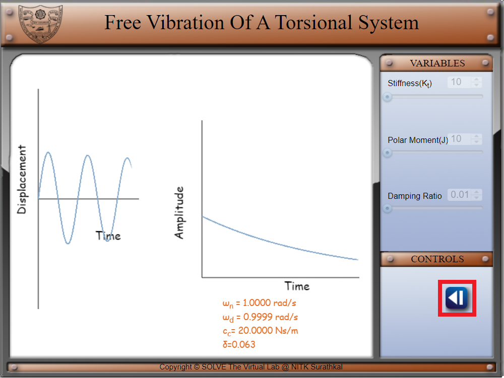

##### These procedure steps will be followed on the simulator 
1.Set a value of stiffness(Kt), Polar Moment(J)  and damping ratio before you begin the experiment. Click on the play button to start the experiment.Observe the values of natural frequency given below. 
 
2.The front view of the torsional system is shown where the green marker shows the angular displacement of the body. 
3.Click on the graph icon to view the displacement vs time and Amplitude vs time graphs. 
 
 
4.Click on the back button to return to the simulation page. 
 
5.Change the value of damping ratio(set it to 0.707).Observe the change in graphs of displacement vs time and amplitude vs frequency. 
 