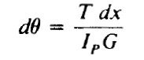
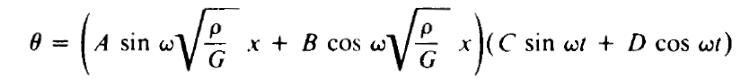
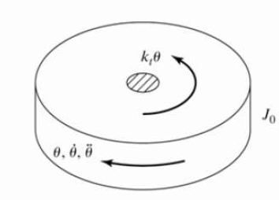
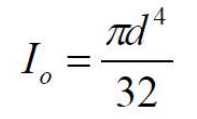
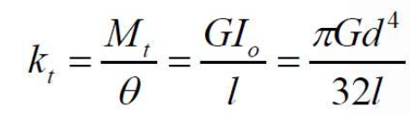

## Introduction 
Torsional vibration is the angular vibration of an object,typically a shaft,along its rotational axis. Torsional vibration is a common source of failure in power transmission systems with rotating shafts or couplings if it is not regulated. 
For a torsional system undergoing vibrations the governing differential equation is- 
Jθ’’+cθ’+kθ= 0  
Let x be measured along the length of the rod, the angle of twistin any length dx of the rod due to a torque T is 
 
where IpG is the torsional stiffness given by the product of the polar moment of inertia Ip of the cross-sectional area and the shear modulus of elasticity G. 
The general solution is 
 
where ρ is the density of the rod m is mass per unit volume 
On solving the differential equations, we get 
For ξ=1,  θ=(c1+c2t)e-ξtwn 

For ξ<1,  θ=e-ξtwn[c1cos(√1-ξ2)wnt+c2sin(√1-ξ2)wnt] 

Where natural frequency of the system wn=√k/J 
 
The resistance of a cylindrical object to torsional deformation when torque is applied in a plane parallel to the cross-section area or perpendicular to the object's central axis is referred to as the polar moment of inertia. It is given by
 
The relation between polar moment of inertia, rigidity modulus, torque is 
 
where Mt is the torque applied on the system.